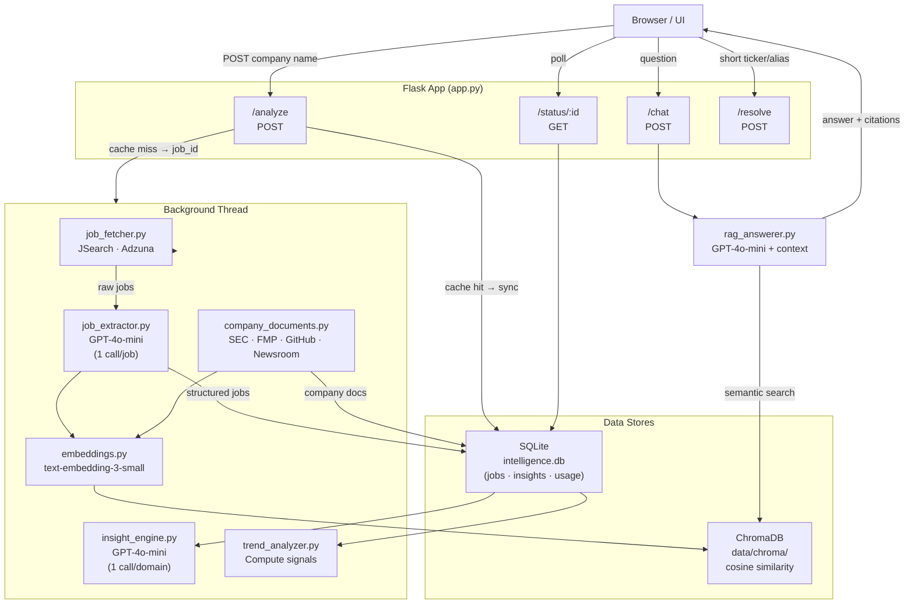

# Read Between The Hires

Read Between The Hires turns a company name into a competitive intelligence brief — in about 30 seconds.

It fetches live job postings, extracts structured signals using GPT, and combines them with official company materials (SEC filings, earnings call transcripts, GitHub releases, newsroom posts) to generate consultant-style strategic insights. A RAG-powered chat lets you ask follow-up questions against the full evidence base.

**Live demo:** [hires.builtthisweekend.com](https://hires.builtthisweekend.com)

---

## What it does

1. **Search any company** — type a company name; the app fetches ~100 recent job postings via JSearch and Adzuna.
2. **Extract intelligence** — each posting is parsed by GPT-4o-mini into structured fields: skills, tools, team names, business goals, domain tags, and metrics mentioned.
3. **Enrich with public sources** — for public companies it pulls earnings call transcripts, SEC filings, investor day materials, GitHub releases, and newsroom posts.
4. **Generate insights** — jobs are grouped into up to 12 domains; GPT produces a strategic insight per domain highlighting what the hiring signals reveal about company priorities.
5. **Trend analysis** — visualises skill frequency, domain mix, and hiring velocity.
6. **RAG chat** — ask anything ("What is their AI strategy?") and get a cited answer grounded in the evidence retrieved.

---

## Architecture



### Domain taxonomy

Every job is tagged with one or more of 12 universal domains:

| Domain | Domain |
|---|---|
| `software_engineering` | `hardware_engineering` |
| `data_analytics` | `ai_ml` |
| `infrastructure_platform` | `product_design` |
| `operations_manufacturing` | `business_commercial` |
| `finance_legal` | `people_talent` |
| `consumer_growth` | `research_science` |

---

## Data sources

| Source | What it provides | Requires |
|---|---|---|
| JSearch (RapidAPI) | Live job postings | `RAPIDAPI_KEY` |
| Adzuna | Additional job postings | `ADZUNA_APP_ID` + `ADZUNA_APP_KEY` (optional) |
| SEC EDGAR | 10-K/10-Q filings, Form D | free |
| Financial Modeling Prep | Earnings call transcripts, investor day | `FMP_API_KEY` (optional) |
| GitHub API | Public release notes | `GITHUB_TOKEN` (optional) |
| Company newsroom | Product updates, press releases | none |

---

## Caching

Results are cached in SQLite for 7 days — searching the same company within that window skips all external API calls and returns instantly.

---

## Setup

### Prerequisites

- Python 3.9
- A RapidAPI account with JSearch enabled
- An OpenAI API key

### Install

```bash
git clone https://github.com/your-username/compete-strategy.git
cd compete-strategy
python3.9 -m venv venv
source venv/bin/activate
pip install -r requirements.txt
```

### Configure

```bash
cp .env.example .env
# fill in OPENAI_API_KEY and RAPIDAPI_KEY at minimum
```

| Variable | Required | Description |
|---|---|---|
| `OPENAI_API_KEY` | Yes | GPT-4o-mini + embeddings |
| `RAPIDAPI_KEY` | Yes | JSearch job postings |
| `RAPIDAPI_HOST` | No | defaults to `jsearch.p.rapidapi.com` |
| `ADMIN_PASSWORD` | No | protects `/admin` dashboard |
| `FMP_API_KEY` | No | earnings call transcripts |
| `GITHUB_TOKEN` | No | higher GitHub API rate limits |

### Run

```bash
source venv/bin/activate
python app.py
```

- App: [http://127.0.0.1:5000](http://127.0.0.1:5000)
- Admin dashboard: [http://127.0.0.1:5000/admin](http://127.0.0.1:5000/admin)

> **Note:** Use `127.0.0.1`, not `localhost` — IPv6 resolution can break on macOS.

---

## RAG evaluation

Once at least one company has been analysed, run the evaluation suite:

```bash
source venv/bin/activate
python eval/evaluate.py
```

Test questions live in [eval/test_questions.json](eval/test_questions.json).

---

## Deployment

The app includes a [Procfile](Procfile) and [railway.toml](railway.toml) for one-click Railway deployment. ChromaDB writes to `data/chroma/` — on platforms with ephemeral filesystems the index is automatically rebuilt from SQLite on startup.

---

## Stack

- **Backend:** Flask, SQLite, ChromaDB
- **AI:** OpenAI GPT-4o-mini (extraction, insights, RAG), `text-embedding-3-small`
- **Job data:** JSearch via RapidAPI
- **Server:** Gunicorn
